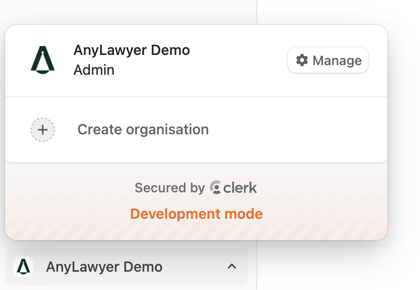

## Prerequisites

- You have an organization created
- You are an organization Admin
- You know the invitee's email address

## Steps

1. Sign in to Anylawyer.
2. Switch to the correct organization from the org switcher (left bottom corner) and click "Manage".

3. Go to Members → Invitations.

4. Click "Invite" and enter the user's email.
5. Select a role:
   - Member: can use all features of AnyLawyer
   - Admin: manage members, billing, and settings
6. Select "Send invitations".
7. The invite appears on the "Invitations" page until the user accepts via email. Once accepted, the member is added with the selected role.

## Troubleshooting

- Invite not received: ask the user to check spam and corporate filters, then select Resend invite.
- Invitee already has an account: they'll join automatically after accepting the invite email.
